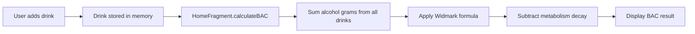
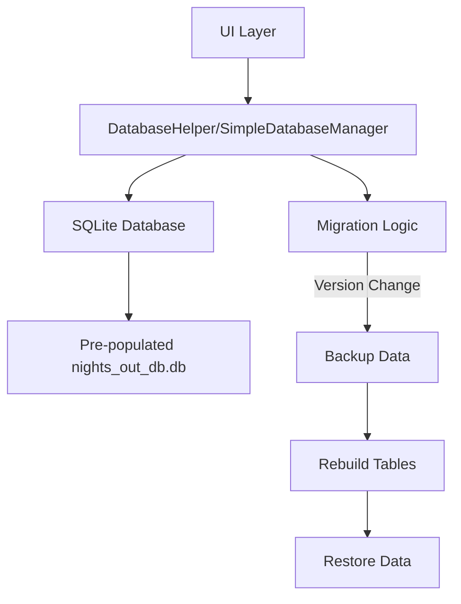

# NightsOut Architecture

## Module Structure

NightsOut uses a Gradle multi-module build with clear separation of concerns:

```
NightsOut/
├── app/                    # Android application module
│   ├── src/main/java/.../
│   └── build.gradle
├── common/                 # Shared Kotlin modules
│   ├── src/main/java/...
│   └── build.gradle
├── common-dialog/          # Reusable dialogs
│   ├── src/main/java/...
│   └── build.gradle
├── db/                     # Database access layer
│   ├── src/main/java/...
│   └── build.gradle
└── profile/                # Profile management
    ├── src/main/java/...
    └── build.gradle
```

### Module Dependencies

```
app → common, db, common-dialog
db → common
common-dialog → common
profile → common
```

## Layer Separation

### 1. Domain Layer (`common/`)

Shared data models and utilities across modules:

- **Models**:
  - [`Drink`](../domain/concepts.md#drink-model): Core domain entity with UUID, ABV, amount, measurements
  - [`LogHeader`](../domain/concepts.md#logheader-model): Encapsulates logged session data (date, BAC, duration)
  - [`VolumeMeasurement`](../domain/concepts.md#volume-measurements): Enum (OZ, ML, BEERS, SHOTS, WINE_GLASSES, PINTS)
  - [`WeightMeasurement`](../domain/concepts.md#weight-measurements): Enum (LBS, KG)

- **Utilities**:
  - `ConversionUtils`: Unit conversions (weight, volume, time)
  - `CountryUtils`, `TimeUtils`: Regional and temporal helpers

- **Constants**:
  - Database config (`DB_NAME`, `DB_PATH`, `DB_VERSION`)
  - Preference keys
  - Measurement arrays

### 2. Data Layer (`db/`)

Database access abstractions:

- **`SimpleDatabaseManager`**: SQLiteOpenHelper wrapper with version migration
- **`DatabaseHelper`**: Legacy helper for compatibility
- **Table Definitions**: `DRINKS_TABLE`, `CURRENT_SESSION_TABLE`, `FAVORITES_TABLE`, `LOG_TABLE`, `LOGGED_DRINKS_TABLE`

### 3. UI Layer (`app/`)

Android Activities and Fragments following MVP-ish patterns:

```
main/
├── MainActivity.kt          # Container with ViewPager
├── NightsOutActivity.kt     # Base Activity with theme handling
└── NightsOutApplication.kt  # Application class

home/                        # Home tab
├── HomeFragment.kt          # BAC display, drink list
├── HomeFragmentDrinkListAdapter.kt
└── HomeFragmentLogDatePicker.kt

addDrink/                    # Add drink flow
├── AddDrinkActivity.kt      # Main add drink screen
├── AddDrinkActivityAlcoholSourceAdapter.kt
├── AddDrinkActivityFavoritesListAdapter.kt
├── AddDrinkActivityRecentsListAdapter.kt
└── ComplexDrinkHelper.kt    # Multi-ingredient drink support

log/                         # Log history tab
├── LogFragment.kt
├── LogFragmentAdapter.kt
└── LogFragmentDatePicker.kt

profile/                     # Profile/settings tab
├── ProfileFragment.kt
├── ProfileFragmentFavoritesListAdapter.kt
└── profile/presenter/       # MVP presenter
```

### 4. Common UI (`common-dialog/`)

Reusable dialog implementations:

- `LightSimpleDialog`, `SimpleDialog`: Generic dialog fragments

### 5. Profile Module

Standalone module for profile management:

```
profile/
├── src/main/java/com/fagerberg/jason/profile/
│   ├── presenter/ProfileFragmentPresenter.kt
│   ├── repository/ProfileFragmentRepository.kt
│   └── view/
│       ├── ProfileFragment.kt
│       ├── ProfileFragmentFavoritesAdapter.kt
│       └── ProfileFragmentViewManager.kt
```

## Data Flow

### BAC Calculation Flow



**Code reference**: [`HomeFragment.kt:258`](https://github.com/fagerbergj/NightsOut/blob/master/app/src/main/java/com/wit/jasonfagerberg/nightsout/home/HomeFragment.kt#L258)

```kotlin
fun calculateBAC(): Double {
    var a = 0.0
    for (drink in mMainActivity.mDrinksList) {
        val volume = mConverter.drinkVolumeToFluidOz(drink.amount, drink.measurement)
        val abv = drink.abv / 100
        a += (volume * abv)  // Total fluid ounces of alcohol
    }
    
    val r = if (mMainActivity.sex!!) .73 else .66  // Body water constant
    val weightInLbs = mConverter.weightToLbs(mMainActivity.weight, mMainActivity.weightMeasurement)
    val sexModifiedWeight = weightInLbs * r
    
    val instantBAC = (a * 5.14) / sexModifiedWeight  // Widmark formula
    
    val hoursElapsed = (mMainActivity.endTimeMin - mMainActivity.startTimeMin) / 60.0
    val bacDecayPerHour = 0.015
    val res = instantBAC - (hoursElapsed * bacDecayPerHour)
    return maxOf(res, 0.0)
}
```

### Database Access Flow



## Application Lifecycle

```
NightsOutApplication.onCreate()
    → PreferenceManager.getDefaultSharedPreferences()
    → Theme initialization
    
MainActivity.onCreate()
    → Initialize fragments (Home, Log, Profile)
    → Setup ViewPager with MyPagerAdapter
    → Initialize DatabaseHelper
    → Load saved preferences (sex, weight, time settings)
    
HomeFragment.onResume()
    → Calculate BAC from in-memory drink list
    → Update UI with current BAC value
    → Display BAC result with contextual meaning
```

## Notification Service

[`BacNotificationService`](https://github.com/fagerbergj/NightsOut/blob/master/app/src/main/java/com/wit/jasonfagerberg/nightsout/notification/BacNotificationService.kt): Foreground service that:

- Updates notification with current BAC level
- Runs based on intent actions (`START_SERVICE`, `UPDATE_NOTIFICATION`)
- Stops when BAC reaches zero or `STOP_SERVICE` is received

## State Management

### SharedPreferences Keys (`Constants.PREFERENCE`)

| Key | Purpose |
|-----|---------|
| `PROFILE_INIT` | Whether user has completed profile setup |
| `PROFILE_SEX` | Biological sex (true=male, false=female) |
| `PROFILE_WEIGHT` | User weight |
| `PROFILE_WEIGHT_MEASUREMENT` | LBS or KG |
| `USE_24_HOUR_TIME` | Time format preference |
| `START_TIME` | Drinking session start (minutes from midnight) |
| `END_TIME` | Drinking session end |
| `SHOW_BAC_NOTIFICATION` | Notification toggle |
| `DONT_SHOW_RATE_DIALOG` | Rating prompt opt-out |

## Theme System

Two themes supported:
- `AppTheme`: Light theme
- `DarkAppTheme`: Dark theme (Material Dialog Alert on API 21+)

## Future Considerations

1. **RXJava Integration**: Presenters use RXJava streams for state management
2. **Module Independence**: Profile module could be extracted to separate library
3. **Database Schema**: Version 40 with UUID migration completed

---

**Next**: See [`/openwiki/workflows/main.md`](../workflows/main.md) for user workflow details.
